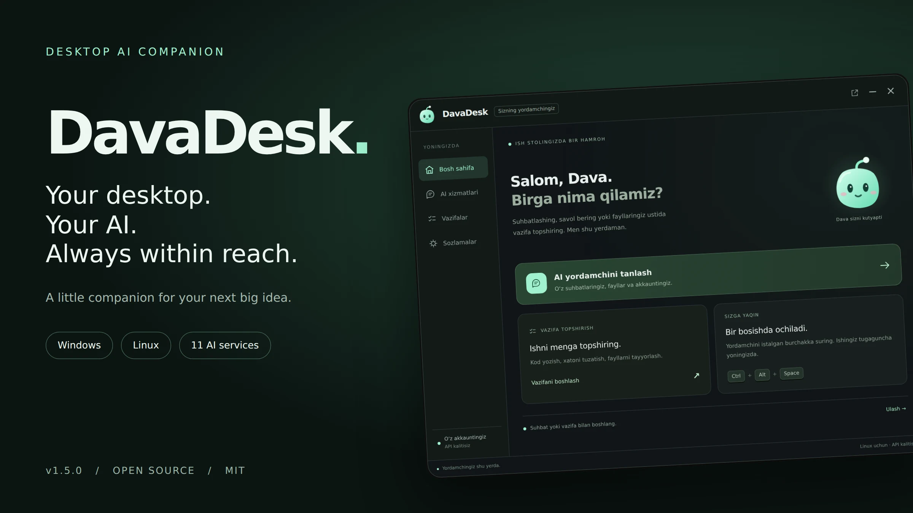

# DavaDesk — ish stolingizdagi AI yordamchi

**Windows va Linux uchun jonli yordamchi.** Qahramonni bosing, kerakli AI’ni tanlang va ishlashni boshlang. Panel kursor chiqqanda yig‘iladi, kichik qahramon esa ish stolida qoladi.

## Yuklash va o‘rnatish

| Tizim | Fayl | Boshlash |
| --- | --- | --- |
| Windows 10/11 x64 | DavaDesk_Windows_x64_v1.5.0.zip | Extract All → DavaDesk.exe. Node.js kerak emas. |
| Linux | DavaDesk_Linux_v1.5.0.zip | Node.js 22+, npm, wmctrl → bash install.sh |

**[Bosqichma-bosqich to‘liq o‘rnatish qo‘llanmasi](docs/INSTALL.md)**

## Imkoniyatlar

- Jonli animatsiya, sichqonchaga reaksiya va istalgan burchakka surish.
- ChatGPT va yana 10 AI: Claude, Gemini, Copilot, Perplexity, DeepSeek, Grok, Le Chat, Qwen, Kimi, Poe.
- Fayl, rasm va ZIPni tanlangan AI’ga biriktirishga uzatish.
- Birinchi kirishda ism tanlash va keyinchalik o‘zgartirish.
- Doim tepada turish va Ctrl+Alt+Space tezkor tugmasi.
- Codex yordamida tanlangan mahalliy papkada vazifalar.

[Qo‘shimcha skrinshotlar](docs/SCREENSHOTS.md)

Har AI’ga dastlab alohida kiriladi. Bir xil email barcha xizmatlarga avtomatik kirish bermaydi. AI xizmatlari tariflari va cheklovlari saqlanadi. Fayl saytga berilishi yuklashni boshlashi mumkin; xabarni Yuborish tugmasi avtomatik bosilmaydi. Sayt o‘zgarsa avtomatik biriktirish ishlamasligi mumkin.

Windows virtual ish stollari uchun Win+Tab → DavaDesk → Show this window on all desktops. Linux’da wmctrl va X11/XWayland ishlatiladi.

45 ta avtomatik test o‘tgan. Windows, haqiqiy GNOME/Wayland va jonli AI akkauntlaridagi yuklashlar ushbu muhitda tekshirilmagan. Skrinshotlar dastur interfeysidan namuna holati bilan olingan.

MIT litsenziyasi. Mustaqil loyiha; AI kompaniyalarining rasmiy ilovasi emas.
