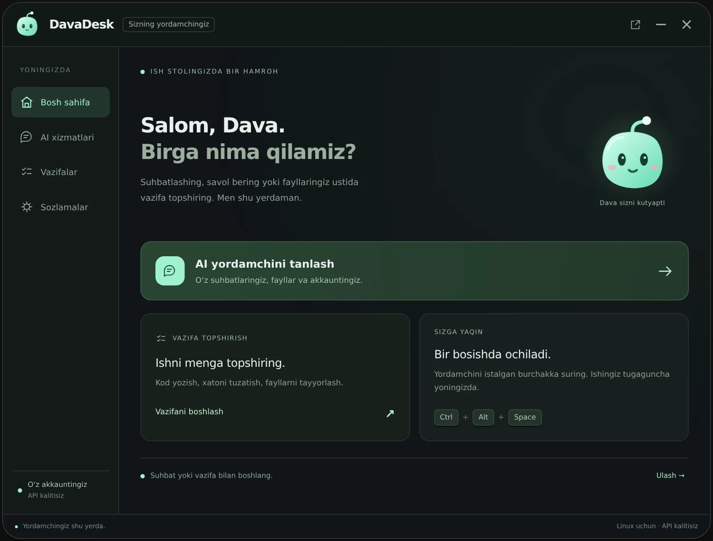
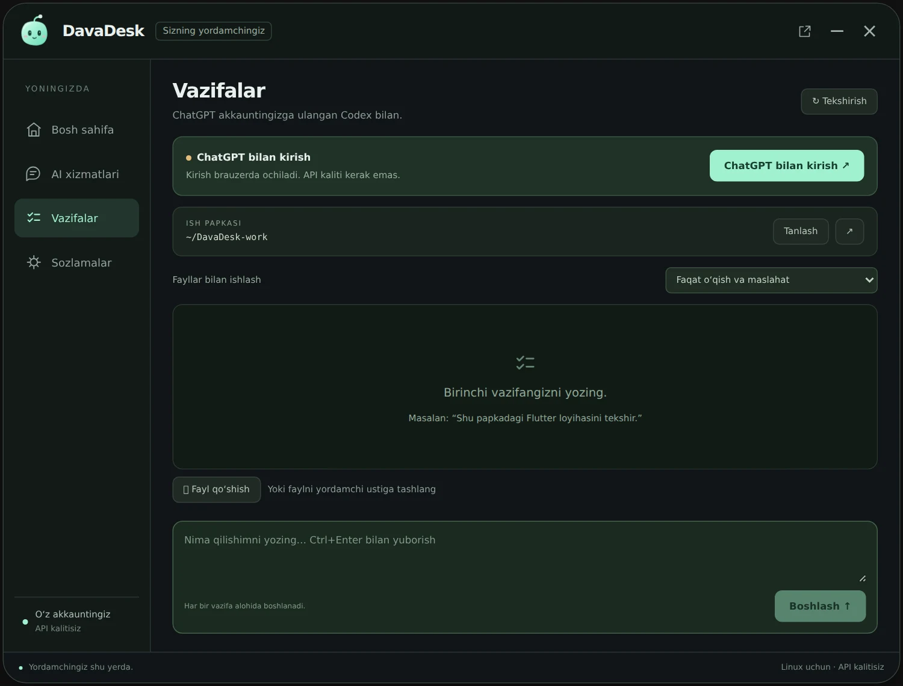
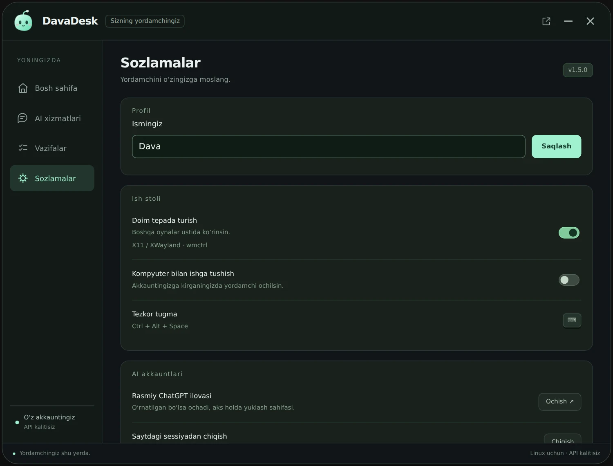

# Interface gallery

These captures render DavaDesk’s actual HTML/CSS/JS with a sample local profile. They show interface design, not a live Windows/Linux session or authenticated AI account. No private account or desktop contents are included.

## Home

## Local tasks

## Settings and profile

## Compact companion

